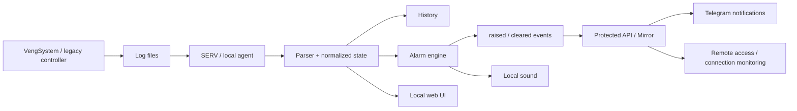

  <a href="README.md">Українська</a> · <a href="README.ru.md">Русский</a> · <b>English</b>

  

# Industrial Ventilation Monitoring & Alerting System

**ECO Piglets** is a local read-only monitoring agent for farm ventilation, temperature and alarm conditions. It modernizes an existing VengSystem setup without interfering with equipment control: it reads real log files, normalizes the data, keeps history, generates alarms and presents the current state in a clean web UI.

  
  
  
  
  
  
  

> [!IMPORTANT]
> This is a **public portfolio case study**, not the production source repository. The implementation, site configuration and credentials remain private.

| | |
|---|---|
| **Solution type** | Local monitoring & alerting agent |
| **Data source** | VengSystem log files |
| **My role** | Process analysis, architecture, AI-assisted implementation, UI/UX, runtime validation |
| **Core idea** | Read-only modernization layer on top of a legacy system |
| **Alerts** | Local sound + Telegram |
| **Status** | Used in a real monitoring workflow |

---

## 🖥️ Product in Action

These are **real application screens**, not mockups: current status, historical charts, the measurement log and local agent settings.

  

Overview · Monitoring · Log · Settings — one local interface for actual VengSystem data.

---

## 🎯 The problem

The site already had a specialized ventilation-control system, but its standard interface did not provide the required remote visibility or reliable notifications for critical conditions.

The goal was to add a separate monitoring layer that:

- **does not change equipment control parameters**;
- works on top of the existing legacy system;
- automatically reads its logs;
- shows current values by room;
- stores history;
- detects abnormal conditions;
- provides a local sound alarm;
- can forward events and periodic reports to Telegram;
- keeps core monitoring available even without internet access.

## 💡 The solution

I designed a separate read-only monitoring layer. The original system remains the source of technical data, while ECO Piglets turns its logs into a practical monitoring workflow.

### Local-first design

The critical path — log reading, state analysis, dashboard and local sound alerts — runs on the PC next to the equipment. Internet access is needed for external notifications, not for the core monitoring loop.

---

## ✅ Implemented

### Data collection and normalization

The system locates the active log, reads the latest complete measurements and converts the legacy format into structured room-level data.

### Alarm detection

Implemented checks include:

- ventilation at `0%`;
- room temperature above an individual threshold;
- missing temperature or ventilation data;
- incomplete log rows;
- stale logs when the original system stops updating data.

### Persistent `raised / cleared` events

An alarm is not stored only as a current-state flag. Start and end transitions are persisted as separate events, so a short incident is not lost between remote polling cycles.

### Message deduplication

The Mirror node stores identifiers for events that have already been delivered, preventing repeated polling or restarts from sending the same alert again.

### Connection monitoring

A short network interruption is not treated as an immediate failure. Connectivity is considered lost only after a configurable grace period of failed checks; recovery before that point resets the timer.

### Web UI

The interface provides current room status, temperature and ventilation values, active alarms, historical charts, a complete measurement log and local settings for the data source, sound alerts and reports.

### Telegram and local sound

In addition to alarm notifications, the system can send periodic informational reports. The local PC provides a repeating sound alarm with a temporary mute option.

---

## 🧱 Two-node architecture and source of truth

**SERV** runs near the equipment. It reads logs, stores snapshot/history, evaluates alarms and produces a persistent event log.

**Mirror / Gateway** receives the prepared state and events, provides remote access, monitors SERV availability and delivers Telegram notifications.

The Mirror **does not re-evaluate process data**. SERV remains the source of truth for alarm logic, reducing the risk of inconsistent results across nodes.

---

## 🛡️ Reliability in a real environment

The architecture accounts for imperfect production conditions:

- logs may be written non-atomically;
- the last row may be incomplete;
- a file may stop updating;
- the local network may briefly disappear;
- the local IP may change;
- remote polling may be slower than a short incident;
- retries must not produce duplicate alerts.

For this reason the system includes freshness checks, persistent events, deduplication, a connection grace period and recovery-oriented behavior.

---

## 👤 My role

I analyzed the actual legacy data format and designed a separate read-only monitoring layer around it.

My responsibilities included problem decomposition, SERV + Mirror architecture, state and event modeling, alarm rules, log parsing, web UI, communication between two computers, Telegram integration, protection against duplicate events and short network outages, testing on real logs and adjusting logic after false positives were observed.

Development used an **AI-assisted workflow**: I defined requirements and architecture, validated actual runtime behavior on real data and decided which changes to accept or revise, using LLMs to accelerate implementation and code analysis.

---

## 🛠️ Technology Stack

`Python` · `Flask` · `JavaScript` · `HTML/CSS` · `REST-style API` · `Telegram` · `Windows` · `LAN integration` · `background monitoring` · `runtime diagnostics`

---

## 🏆 Result

The existing ventilation system gained a modern monitoring layer **without changing its control logic**.

**Legacy logs → structured state → alarm engine → persistent events → web / sound / Telegram → history & diagnostics**

This case demonstrates work at the intersection of software, legacy integration, network infrastructure and real equipment, with reliability treated as part of the product rather than an afterthought.

---

## 🎥 Demo / Source availability

The production source repository is **private**. This repository contains only the portfolio case study, screenshots and architecture description.

For a technical interview, I can demonstrate the system and discuss the monitoring logic, event model and reliability decisions without publishing the production source code.
