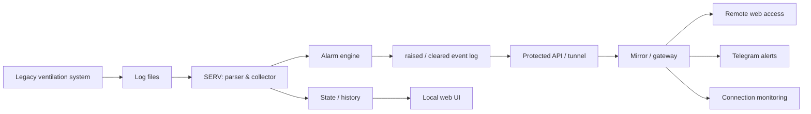

# Industrial Ventilation Monitoring & Alerting System

[Українська](README.md) · [Русский](README.ru.md) · **English**

> **Internal project name:** VengMonitor  
> **Status:** used in a real monitoring workflow  
> **Source code:** private

A monitoring system for industrial ventilation created to modernize an existing legacy solution without interfering with equipment control.

Instead of replacing the original system, the application reads its actual log files, converts them into structured data, monitors both room conditions and the data collection process itself, creates durable alarm events, and delivers information through a web interface and Telegram.

---

## Problem

A specialized ventilation control system was already operating on site, but its native interface did not provide the required level of remote monitoring and reliable alerting for critical conditions.

The goal was to build a separate read-only monitoring layer that:

- does not modify equipment control parameters;
- works on top of the existing system;
- automatically reads its logs;
- detects abnormal conditions;
- stores history and alarm state;
- works across multiple computers;
- does not lose short-lived alarms between polling cycles;
- continues to provide meaningful diagnostics when connectivity is unstable.

---

## Solution architecture

The system is split into two nodes.

### SERV — node near the equipment

SERV reads and parses the original system logs, stores the current snapshot, history and active alarms, and creates a durable `raised` / `cleared` event stream.

### Mirror / Gateway — remote node

The remote node receives prepared state and events from SERV, exposes remote access to the interface, checks availability of the primary node, and forwards notifications to Telegram.

Mirror does not independently re-evaluate process alarms. SERV remains the source of truth for alarm logic, which reduces the risk of state divergence between nodes.

---

## Implemented functionality

### Data collection and normalization

The system automatically identifies the current log file, reads the latest measurements and converts the legacy format into structured room-level data.

### Process alarm detection

The monitoring logic detects conditions including:

- ventilation at `0%`;
- temperature above a per-room threshold;
- missing temperature or ventilation values;
- incomplete log rows;
- stale logs when the original system stops updating data.

### Durable `raised` / `cleared` events

An alarm is not treated as a simple current-state flag. The system creates durable events for both alarm activation and recovery.

This prevents short incidents from disappearing when they begin and end between two polling cycles of the remote node.

### Notification deduplication

Mirror stores identifiers of already forwarded events, so repeated polling does not produce duplicate Telegram notifications.

### Connectivity monitoring

A short network interruption is not immediately considered an incident. A connection-loss event is generated only after a configured period of failed checks; recovery before that threshold resets the timer.

This reduces alert noise caused by brief network drops.

### Web interface

The interface exposes current measurements, historical data, active alarms and room settings. Room display names and monitoring thresholds can be configured independently.

### Telegram and periodic reports

In addition to incident notifications, the system can send scheduled status reports with current measurements or temperature charts.

### Local alerting

The computer near the equipment can also play a local sound notification so that a critical event remains noticeable without an open browser.

---

## Reliability in a real environment

The project required more than writing a parser. It had to account for the behavior of a real legacy system:

- log files may be written non-atomically;
- the latest row may be incomplete;
- network connectivity may temporarily disappear;
- the local node IP may change;
- the remote node may poll less frequently than a short alarm lasts;
- notifications must not be duplicated after retries or restarts.

For that reason, the architecture explicitly includes durable state, an event journal, deduplication, data freshness checks and recovery-oriented behavior.

---

## My role

I analyzed the actual data format of the existing system and designed a separate read-only monitoring layer around the legacy solution.

My responsibilities included:

- problem definition and decomposition;
- two-node architecture;
- state and alarm model;
- log parsing;
- alarm rules;
- web interface;
- communication between machines;
- Telegram notification flow;
- duplicate and short-network-failure protection;
- testing against real logs and the real operating environment;
- refining logic after false-positive behavior was observed.

Development was performed in an AI-assisted workflow: I defined requirements and architecture, validated behavior on real data and hardware, analyzed failures and made decisions about changes, while using LLMs to accelerate implementation and code analysis.

---

## Technology context

- Python
- Flask
- JavaScript / HTML / CSS
- REST-style API
- file-based state and history storage
- Telegram integration
- Windows automation
- LAN / network integration
- background monitoring and alerting
- runtime diagnostics

---

## Result

The existing ventilation system gained a separate modern monitoring layer without modification of its control logic.

The workflow changed from manual log inspection to:

**legacy logs → structured data → state monitoring → durable events → web / Telegram → history and diagnostics.**

This case demonstrates work at the intersection of software, legacy integration, networking infrastructure and real equipment.

---

## Source availability

The working source repository is **private** and is not distributed through this portfolio repository.

This repository contains only the case study. It does not include application source code, site-specific configuration, credentials or distributable builds.

For recruitment or technical interviews, I can demonstrate the system and discuss architecture, monitoring logic and engineering decisions without publishing the private implementation.
