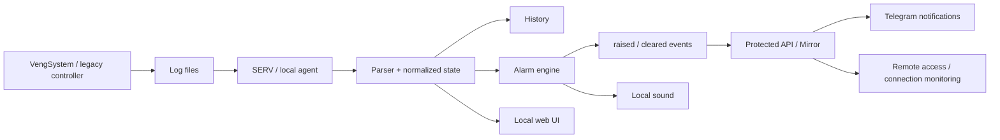

  <b>Українська</b> · <a href="README.ru.md">Русский</a> · <a href="README.en.md">English</a>

  

# Industrial Ventilation Monitoring & Alerting System

**ECO Piglets** — локальний read-only агент для моніторингу вентиляції, температури та аварійних станів на фермі. Система модернізує існуюче VengSystem-рішення без втручання у керування обладнанням: читає фактичні журнали, структурує дані, веде історію, формує тривоги та показує стан у зручному web UI.

  
  
  
  
  
  
  

> [!IMPORTANT]
> Це **публічний portfolio case study**, а не репозиторій із вихідним кодом. Production-реалізація, конфігурації об'єкта та облікові дані залишаються приватними.

| | |
|---|---|
| **Тип рішення** | Local monitoring & alerting agent |
| **Джерело даних** | VengSystem log files |
| **Моя роль** | Аналіз процесу, архітектура, AI-assisted implementation, UI/UX, runtime validation |
| **Ключова ідея** | Read-only modernization layer поверх legacy-системи |
| **Сповіщення** | Local sound + Telegram |
| **Статус** | Використовується у реальному процесі моніторингу |

---

## 🖥️ Product in Action

Нижче — **реальні екрани системи**, а не mockup: огляд поточного стану, історичні графіки, повний журнал вимірювань і локальні налаштування агента.

  

Overview · Monitoring · Log · Settings — один локальний інтерфейс для контролю фактичних даних VengSystem.

---

## 🎯 Задача

На об'єкті вже працювала спеціалізована система керування вентиляцією, але її штатний інтерфейс не давав потрібного віддаленого контролю та надійного сповіщення про критичні ситуації.

Потрібно було додати окремий шар моніторингу, який:

- **не змінює керуючі параметри обладнання**;
- працює поверх існуючої legacy-системи;
- автоматично читає її журнали;
- показує поточні значення по приміщеннях;
- зберігає історію;
- виявляє аварійні стани;
- дає локальний звуковий сигнал;
- може передавати події та періодичні звіти у Telegram;
- продовжує базовий моніторинг навіть без інтернету.

## 💡 Рішення

Я спроєктувала окремий read-only контур, де штатна система залишається джерелом технологічних даних, а ECO Piglets перетворює журнали на зручний monitoring workflow.

### Local-first принцип

Критична частина системи — читання логів, аналіз стану, dashboard і локальний звук — працює на ПК біля обладнання. Інтернет потрібен для зовнішніх повідомлень, але не для самого контролю.

---

## ✅ Що реалізовано

### Збір і нормалізація даних

Система знаходить актуальний журнал, читає останні повні вимірювання та перетворює legacy-формат у структуровані дані по приміщеннях.

### Контроль аварій

Реалізовано виявлення, зокрема:

- вентиляції `0%`;
- перевищення індивідуального температурного порогу;
- відсутніх даних температури або вентиляції;
- неповного рядка журналу;
- застарілого журналу, коли штатна система перестала оновлювати дані.

### Стійкі події `raised / cleared`

Тривога не є лише поточним прапорцем. Виникнення та завершення аварії записуються як окремі події. Це дозволяє не втратити коротку проблему між двома циклами опитування віддаленого вузла.

### Дедуплікація повідомлень

Mirror зберігає ідентифікатори вже переданих подій, тому повторні запити або перезапуск не повинні дублювати ту саму тривогу.

### Контроль зв'язку

Короткий мережевий збій не вважається аварією миттєво. Втрата зв'язку фіксується лише після заданого інтервалу безуспішних перевірок; відновлення до завершення цього інтервалу скидає таймер.

### Web UI

Інтерфейс показує:

- поточний стан приміщень;
- температуру та вентиляцію;
- активні тривоги;
- історичні графіки;
- повний журнал вимірювань;
- локальні налаштування джерела даних, звуку та звітів.

### Telegram і локальний звук

Крім аварійних Telegram-повідомлень система може надсилати періодичні інформаційні звіти. На локальному ПК підтримується повторюваний звуковий сигнал із можливістю тимчасового mute.

---

## 🧱 Два вузли та source of truth

**SERV** біля обладнання читає логи, зберігає snapshot/history, визначає тривоги та формує стійкий event log.

**Mirror / Gateway** отримує готовий стан та події, надає віддалений доступ, контролює доступність SERV і доставляє повідомлення у Telegram.

Mirror **не переаналізує технологічні дані**: source of truth для тривог залишається на SERV. Це зменшує ризик різних результатів на двох вузлах.

---

## 🛡️ Надійність у реальному середовищі

Проєкт вимагав врахувати поведінку неідеального production-середовища:

- журнал може записуватися неатомарно;
- останній рядок може бути неповним;
- файл може перестати оновлюватися;
- локальна мережа може короткочасно зникати;
- IP вузла може змінюватися;
- віддалений polling може бути рідшим за тривалість короткої аварії;
- повторна доставка не повинна створювати duplicate alerts.

Тому в системі окремо передбачені freshness checks, persistent events, deduplication, connection grace period та відновлення після збоїв.

---

## 👤 Моя роль

Я аналізувала фактичний формат даних legacy-системи й спроєктувала окремий read-only monitoring layer.

Моя зона відповідальності:

- постановка та декомпозиція задачі;
- архітектура SERV + Mirror;
- модель стану і подій;
- правила тривог;
- парсинг журналів;
- web UI;
- обмін між двома комп'ютерами;
- Telegram integration;
- захист від duplicate events і коротких мережевих збоїв;
- тестування на фактичних журналах та у реальному середовищі;
- коригування логіки після виявлення false positives.

Розробка виконувалася в **AI-assisted workflow**: я задавала вимоги й архітектуру, перевіряла фактичну поведінку на реальних даних та приймала рішення щодо змін, використовуючи LLM для прискорення implementation і code analysis.

---

## 🛠️ Technology Stack

`Python` · `Flask` · `JavaScript` · `HTML/CSS` · `REST-style API` · `Telegram` · `Windows` · `LAN integration` · `background monitoring` · `runtime diagnostics`

---

## 🏆 Результат

Існуюча вентиляційна система отримала окремий сучасний шар моніторингу **без втручання у її керуючу логіку**.

**Legacy logs → structured state → alarm engine → persistent events → web / sound / Telegram → history & diagnostics**

Цей кейс демонструє роботу на межі software, legacy integration, мережевої інфраструктури та реального обладнання — із фокусом не лише на функціях, а й на надійності.

---

## 🎥 Demo / Source availability

Робочий source repository є **приватним**. Цей репозиторій містить лише portfolio case study, screenshots та опис архітектури.

На технічній співбесіді я можу продемонструвати систему та обговорити monitoring logic, event model і рішення щодо надійності без публікації production source code.
