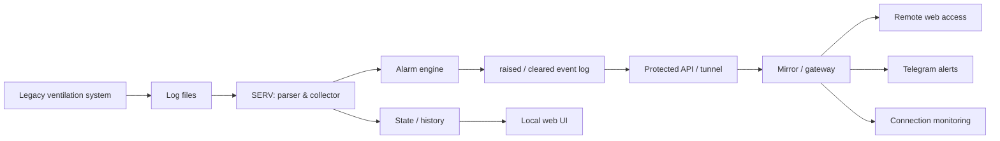

# Industrial Ventilation Monitoring & Alerting System

**Українська** · [Русский](README.ru.md) · [English](README.en.md)

> **Внутрішня назва:** VengMonitor  
> **Статус:** використовується в реальному процесі моніторингу  
> **Вихідний код:** приватний

Система моніторингу промислової вентиляції, створена для модернізації існуючого legacy-рішення без втручання в його керування обладнанням.

Замість заміни штатної системи програма читає її фактичні журнали, перетворює їх на структуровані дані, контролює стан приміщень і самої системи збору даних, формує події тривог та доставляє їх через веб-інтерфейс і Telegram.

---

## Задача

На об'єкті вже працювала спеціалізована система керування вентиляцією, але її штатний інтерфейс не давав потрібного віддаленого контролю та надійного сповіщення про критичні ситуації.

Потрібно було отримати окремий read-only шар моніторингу, який:

- не змінює керуючі параметри обладнання;
- працює поверх уже наявної системи;
- автоматично читає її журнали;
- виявляє аварійні стани;
- зберігає історію та стан тривог;
- працює між кількома комп'ютерами;
- не втрачає короткі тривоги між циклами опитування;
- повідомляє про проблеми навіть при нестабільному зв'язку.

---

## Архітектура рішення

Система розділена на два вузли.

### SERV — вузол біля обладнання

Він читає та розбирає журнали штатної системи, зберігає поточний snapshot, історію та активні тривоги, а також формує стійкий журнал подій `raised` / `cleared`.

### Mirror / Gateway — віддалений вузол

Він отримує готовий стан і події від SERV, надає віддалений доступ до інтерфейсу, контролює доступність основного вузла та доставляє сповіщення в Telegram.

Mirror не аналізує технологічні дані повторно: джерелом істини для тривог залишається SERV. Це зменшує ризик розбіжностей між двома вузлами.

---

## Що реалізовано

### Збір і нормалізація даних

Система автоматично знаходить актуальний журнал, читає останні вимірювання та перетворює legacy-формат у структуровані дані по приміщеннях.

### Контроль технологічних аварій

Реалізовано виявлення, зокрема:

- вентиляції `0%`;
- перевищення індивідуального температурного порогу;
- відсутніх даних температури або вентиляції;
- неповного рядка журналу;
- застарілого журналу, коли штатна система перестала оновлювати дані.

### Події `raised` / `cleared`

Тривога не є просто поточним прапорцем. Система створює окремі стійкі події виникнення та завершення аварії.

Завдяки цьому коротка аварія не губиться, навіть якщо вона почалася і завершилася між двома опитуваннями віддаленого вузла.

### Захист від дублювання повідомлень

Mirror зберігає ідентифікатори вже переданих подій, тому повторне опитування не призводить до повторного надсилання тієї самої тривоги.

### Контроль втрати зв'язку

Короткий мережевий збій не вважається аварією одразу. Втрата зв'язку фіксується тільки після заданого інтервалу безуспішних перевірок; відновлення до завершення цього інтервалу скидає таймер.

Це прибирає зайві повідомлення при коротких мережевих просіданнях.

### Веб-інтерфейс

Доступні поточні показники, історія, активні аварії та налаштування приміщень. Для кімнат можна задавати власні назви та пороги контролю.

### Telegram і періодичні звіти

Крім аварійних повідомлень система може надсилати регулярний інформаційний звіт із поточними показниками або графіком температур.

### Локальне сповіщення

На комп'ютері біля обладнання підтримується локальний звуковий сигнал, щоб критична подія була помітна навіть без відкритого браузера.

---

## Надійність і робота з реальним середовищем

Цей проєкт вимагав не лише написати парсер, а й врахувати поведінку реальної системи:

- журнали можуть записуватися неатомарно;
- останній рядок може бути неповним;
- мережа може короткочасно зникати;
- IP локального вузла може змінюватися;
- віддалений вузол може опитувати систему рідше, ніж триває коротка аварія;
- повідомлення не повинні дублюватися після повторних запитів або перезапусків.

Тому в архітектурі окремо враховані стійкий стан, журнал подій, дедуплікація, контроль свіжості даних та відновлення після збоїв.

---

## Моя роль

Я аналізувала реальний формат даних існуючої системи та спроєктувала окремий read-only контур моніторингу поверх legacy-рішення.

Моя зона відповідальності охоплювала:

- постановку задачі та декомпозицію;
- архітектуру двох вузлів;
- модель стану та тривог;
- парсинг журналів;
- правила виявлення аварій;
- веб-інтерфейс;
- обмін даними між комп'ютерами;
- Telegram-сповіщення;
- захист від дублікатів і коротких мережевих збоїв;
- тестування на фактичних журналах і в реальному середовищі;
- коригування логіки після виявлення хибних спрацьовувань.

Розробка виконувалася в AI-assisted workflow: я визначала вимоги й архітектуру, перевіряла поведінку на реальному обладнанні та даних, аналізувала помилки й приймала рішення щодо змін, використовуючи LLM для прискорення реалізації та аналізу коду.

---

## Технології

- Python
- Flask
- JavaScript / HTML / CSS
- REST-style API
- file-based state and history storage
- Telegram integration
- Windows automation
- LAN / network integration
- background monitoring and alerting
- runtime diagnostics

---

## Результат

Існуюча вентиляційна система отримала окремий сучасний шар моніторингу без втручання в її керуючу логіку.

Замість ручної перевірки журналів з'явився процес:

**legacy logs → структуровані дані → контроль стану → стійкі події → веб / Telegram → історія та діагностика.**

Цей кейс показує роботу на межі software, legacy integration, мережевої інфраструктури та реального обладнання.

---

## Доступність вихідного коду

Робочий репозиторій проєкту є **приватним** і не публікується через цей portfolio repository.

Цей репозиторій містить лише опис кейсу. Тут немає вихідного коду застосунку, конфігурацій об'єкта, облікових даних або готових збірок.

На технічній співбесіді я можу продемонструвати систему та детально обговорити архітектуру, логіку моніторингу й інженерні рішення без публікації приватного коду.
