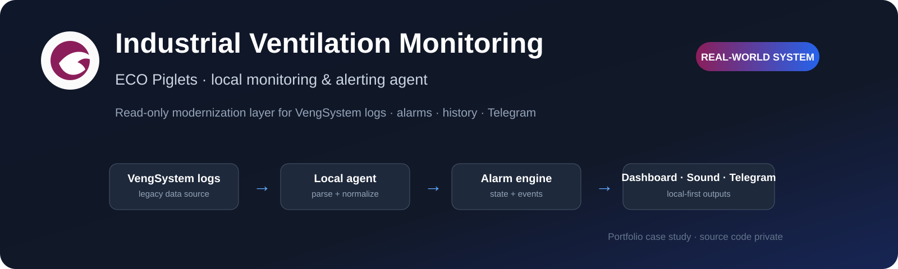
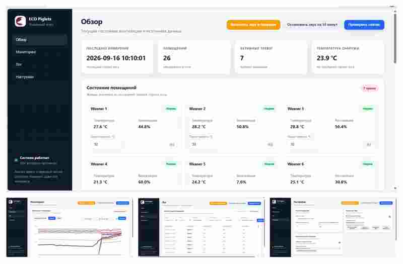
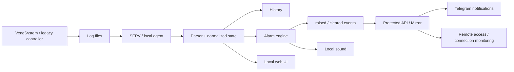

  <a href="README.md">Українська</a> · <b>Русский</b> · <a href="README.en.md">English</a>

  

# Industrial Ventilation Monitoring & Alerting System

**ECO Piglets** — локальный read-only агент для мониторинга вентиляции, температуры и аварийных состояний на ферме. Система модернизирует существующее VengSystem-решение без вмешательства в управление оборудованием: читает фактические журналы, структурирует данные, ведёт историю, формирует тревоги и показывает состояние в удобном web UI.

  
  
  
  
  
  
  

> [!IMPORTANT]
> Это **публичный portfolio case study**, а не репозиторий с исходным кодом. Production-реализация, конфигурации объекта и учётные данные остаются приватными.

| | |
|---|---|
| **Тип решения** | Local monitoring & alerting agent |
| **Источник данных** | VengSystem log files |
| **Моя роль** | Анализ процесса, архитектура, AI-assisted implementation, UI/UX, runtime validation |
| **Ключевая идея** | Read-only modernization layer поверх legacy-системы |
| **Оповещения** | Local sound + Telegram |
| **Статус** | Используется в реальном процессе мониторинга |

---

## 🖥️ Product in Action

Ниже — **реальные экраны системы**, а не mockup: текущий статус, исторические графики, полный журнал измерений и локальные настройки агента.

  

Overview · Monitoring · Log · Settings — единый локальный интерфейс для контроля фактических данных VengSystem.

---

## 🎯 Задача

На объекте уже работала специализированная система управления вентиляцией, но штатный интерфейс не давал удобного удалённого контроля и надёжных уведомлений о критических ситуациях.

Нужно было добавить отдельный слой мониторинга, который:

- **не изменяет управляющие параметры оборудования**;
- работает поверх существующей legacy-системы;
- автоматически читает её журналы;
- показывает текущие значения по помещениям;
- сохраняет историю;
- обнаруживает аварийные состояния;
- даёт локальный звуковой сигнал;
- передаёт события и периодические отчёты в Telegram;
- продолжает базовый мониторинг даже без интернета.

## 💡 Решение

Я спроектировала отдельный read-only контур, где штатная система остаётся источником технологических данных, а ECO Piglets превращает её журналы в полноценный monitoring workflow.

### Local-first принцип

Критическая часть системы — чтение логов, анализ состояния, dashboard и локальный звук — работает на ПК возле оборудования. Интернет нужен для внешних сообщений, но не для самого контроля.

---

## ✅ Что реализовано

### Сбор и нормализация данных

Система находит актуальный журнал, читает последние полные измерения и преобразует legacy-формат в структурированные данные по помещениям.

### Контроль аварий

Реализовано обнаружение, в частности:

- вентиляции `0%`;
- превышения индивидуального температурного порога;
- отсутствующих данных температуры или вентиляции;
- неполной строки журнала;
- устаревшего журнала, когда штатная система перестала обновлять данные.

### Устойчивые события `raised / cleared`

Тревога не хранится только как текущий флаг. Возникновение и завершение аварии записываются как отдельные события, поэтому короткая проблема не теряется между циклами опроса удалённого узла.

### Дедупликация сообщений

Mirror хранит идентификаторы уже переданных событий, поэтому повторный polling или перезапуск не должны создавать duplicate alerts.

### Контроль связи

Короткий сетевой сбой не считается аварией сразу. Потеря связи фиксируется только после заданного интервала неудачных проверок; восстановление до окончания этого интервала сбрасывает таймер.

### Web UI

Интерфейс показывает текущий статус помещений, температуру и вентиляцию, активные тревоги, исторические графики, полный журнал измерений и локальные настройки источника данных, звука и отчётов.

### Telegram и локальный звук

Кроме аварийных Telegram-сообщений система может отправлять периодические информационные отчёты. На локальном ПК поддерживается повторяющийся звуковой сигнал с временным mute.

---

## 🧱 Два узла и source of truth

**SERV** рядом с оборудованием читает логи, хранит snapshot/history, определяет тревоги и формирует устойчивый event log.

**Mirror / Gateway** получает готовое состояние и события, предоставляет удалённый доступ, следит за доступностью SERV и доставляет сообщения в Telegram.

Mirror **не анализирует технологические данные повторно**: source of truth для тревог остаётся на SERV. Это уменьшает риск расхождений между двумя узлами.

---

## 🛡️ Надёжность в реальной среде

Архитектура учитывает, что production-среда неидеальна:

- журнал может записываться неатомарно;
- последняя строка может быть неполной;
- файл может перестать обновляться;
- локальная сеть может кратковременно исчезать;
- IP узла может измениться;
- удалённый polling может быть реже длительности короткой аварии;
- повторная доставка не должна создавать duplicate alerts.

Поэтому в системе отдельно предусмотрены freshness checks, persistent events, deduplication, connection grace period и восстановление после сбоев.

---

## 👤 Моя роль

Я анализировала фактический формат данных legacy-системы и спроектировала отдельный read-only monitoring layer.

Моя зона ответственности включала постановку и декомпозицию задачи, архитектуру SERV + Mirror, модель состояния и событий, правила тревог, парсинг журналов, web UI, обмен между двумя компьютерами, Telegram integration, защиту от duplicate events и кратковременных сетевых сбоев, а также тестирование на реальных журналах и корректировку логики после false positives.

Разработка велась в **AI-assisted workflow**: я задавала требования и архитектуру, проверяла фактическое поведение на реальных данных и принимала решения по изменениям, используя LLM для ускорения implementation и code analysis.

---

## 🛠️ Technology Stack

`Python` · `Flask` · `JavaScript` · `HTML/CSS` · `REST-style API` · `Telegram` · `Windows` · `LAN integration` · `background monitoring` · `runtime diagnostics`

---

## 🏆 Результат

Существующая вентиляционная система получила современный отдельный слой мониторинга **без вмешательства в её управляющую логику**.

**Legacy logs → structured state → alarm engine → persistent events → web / sound / Telegram → history & diagnostics**

Кейс показывает работу на стыке software, legacy integration, сетевой инфраструктуры и реального оборудования — с фокусом не только на функциях, но и на надёжности.

---

## 🎥 Demo / Source availability

Рабочий source repository является **приватным**. Этот репозиторий содержит только portfolio case study, screenshots и описание архитектуры.

На техническом интервью я могу показать систему и обсудить monitoring logic, event model и решения по надёжности без публикации production source code.
