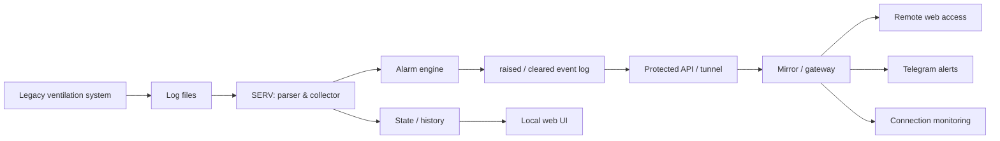

# Industrial Ventilation Monitoring & Alerting System

[Українська](README.md) · **Русский** · [English](README.en.md)

> **Внутреннее название:** VengMonitor  
> **Статус:** используется в реальном процессе мониторинга  
> **Исходный код:** приватный

Система мониторинга промышленной вентиляции, созданная для модернизации существующего legacy-решения без вмешательства в управление оборудованием.

Вместо замены штатной системы программа читает её фактические журналы, превращает их в структурированные данные, контролирует состояние помещений и самой системы сбора данных, формирует события тревог и доставляет их через веб-интерфейс и Telegram.

---

## Задача

На объекте уже работала специализированная система управления вентиляцией, но её штатный интерфейс не давал нужного удалённого контроля и надёжного уведомления о критических ситуациях.

Нужно было получить отдельный read-only слой мониторинга, который:

- не изменяет управляющие параметры оборудования;
- работает поверх уже существующей системы;
- автоматически читает её журналы;
- выявляет аварийные состояния;
- хранит историю и состояние тревог;
- работает между несколькими компьютерами;
- не теряет короткие тревоги между циклами опроса;
- сообщает о проблемах даже при нестабильной связи.

---

## Архитектура решения

Система разделена на два узла.

### SERV — узел возле оборудования

Он читает и разбирает журналы штатной системы, хранит текущий snapshot, историю и активные тревоги, а также формирует устойчивый журнал событий `raised` / `cleared`.

### Mirror / Gateway — удалённый узел

Он получает готовое состояние и события от SERV, предоставляет удалённый доступ к интерфейсу, контролирует доступность основного узла и доставляет уведомления в Telegram.

Mirror не анализирует технологические данные повторно: источником истины для тревог остаётся SERV. Это снижает риск расхождений между двумя узлами.

---

## Что реализовано

### Сбор и нормализация данных

Система автоматически находит актуальный журнал, читает последние измерения и преобразует legacy-формат в структурированные данные по помещениям.

### Контроль технологических аварий

Реализовано обнаружение, в частности:

- вентиляции `0%`;
- превышения индивидуального температурного порога;
- отсутствующих данных температуры или вентиляции;
- неполной строки журнала;
- устаревшего журнала, когда штатная система перестала обновлять данные.

### События `raised` / `cleared`

Тревога не является просто текущим флагом. Система создаёт отдельные устойчивые события возникновения и завершения аварии.

Благодаря этому короткая авария не теряется, даже если она началась и закончилась между двумя опросами удалённого узла.

### Защита от дублирования сообщений

Mirror хранит идентификаторы уже переданных событий, поэтому повторный опрос не приводит к повторной отправке одной и той же тревоги.

### Контроль потери связи

Короткий сетевой сбой не считается аварией сразу. Потеря связи фиксируется только после заданного интервала безуспешных проверок; восстановление до завершения этого интервала сбрасывает таймер.

Это убирает лишние уведомления при кратковременных сетевых просадках.

### Веб-интерфейс

Доступны текущие показатели, история, активные аварии и настройки помещений. Для комнат можно задавать собственные названия и пороги контроля.

### Telegram и периодические отчёты

Кроме аварийных сообщений система может отправлять регулярный информационный отчёт с текущими показателями или графиком температур.

### Локальное оповещение

На компьютере возле оборудования поддерживается локальный звуковой сигнал, чтобы критическое событие было заметно даже без открытого браузера.

---

## Надёжность и работа с реальной средой

Этот проект потребовал не только написать парсер, но и учесть поведение реальной системы:

- журналы могут записываться неатомарно;
- последняя строка может быть неполной;
- сеть может кратковременно пропадать;
- IP локального узла может изменяться;
- удалённый узел может опрашивать систему реже, чем длится короткая авария;
- сообщения не должны дублироваться после повторных запросов или перезапусков.

Поэтому в архитектуре отдельно учтены устойчивое состояние, журнал событий, дедупликация, контроль свежести данных и восстановление после сбоев.

---

## Моя роль

Я анализировала реальный формат данных существующей системы и спроектировала отдельный read-only контур мониторинга поверх legacy-решения.

Моя зона ответственности включала:

- постановку задачи и декомпозицию;
- архитектуру двух узлов;
- модель состояния и тревог;
- парсинг журналов;
- правила выявления аварий;
- веб-интерфейс;
- обмен данными между компьютерами;
- Telegram-уведомления;
- защиту от дублей и коротких сетевых сбоев;
- тестирование на фактических журналах и в реальной среде;
- корректировку логики после обнаружения ложных срабатываний.

Разработка выполнялась в AI-assisted workflow: я определяла требования и архитектуру, проверяла поведение на реальном оборудовании и данных, анализировала ошибки и принимала решения по изменениям, используя LLM для ускорения реализации и анализа кода.

---

## Технологии

- Python
- Flask
- JavaScript / HTML / CSS
- REST-style API
- file-based state and history storage
- Telegram integration
- Windows automation
- LAN / network integration
- background monitoring and alerting
- runtime diagnostics

---

## Результат

Существующая вентиляционная система получила отдельный современный слой мониторинга без вмешательства в её управляющую логику.

Вместо ручной проверки журналов появился процесс:

**legacy logs → структурированные данные → контроль состояния → устойчивые события → web / Telegram → история и диагностика.**

Этот кейс показывает работу на стыке software, legacy integration, сетевой инфраструктуры и реального оборудования.

---

## Доступность исходного кода

Рабочий репозиторий проекта является **приватным** и не публикуется через этот portfolio repository.

Этот репозиторий содержит только описание кейса. Здесь нет исходного кода приложения, конфигураций объекта, учётных данных или готовых сборок.

На техническом собеседовании я могу продемонстрировать систему и подробно обсудить архитектуру, логику мониторинга и инженерные решения без публикации приватного кода.
